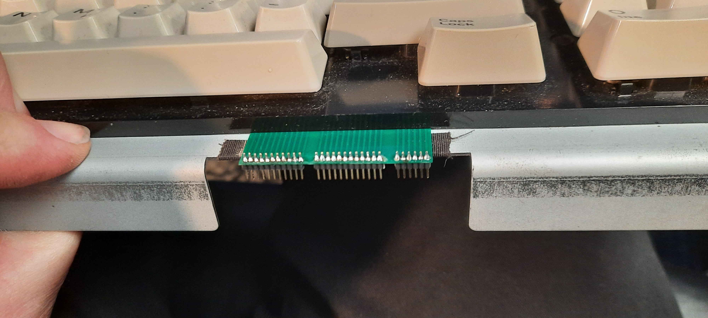

# Schneider Euro PC Keyboard Replacement PCB 

## Background & Problem 

At the time of this writing (2023), the keyboard "membranes" of the
1988 Schneider Euro PCs are, most likely, pretty much fully
deteriorated. Restoring the Euro PC's keyboard is one of the biggest
challenge in keeping these nice old vintage machines fully functional.

Technically, the Euro PC keyboards are not really "membranes" - they
just consist of a single sheet of Mylar with traces and button contact
zones of conducting paint. The keys are "stamps" that close these
contacts, made from conducting rubber. So it's more appropriate to
call them conducting Mylar "sheet" keyboards. I'll use the term Mylar
sheet keyboard in the following.

Whereas it is possible to repair the traces and contact zones with
conducting "leitsilber" on the Mylar sheet, the worst part of the Euro
is the flexcable that connect the sheet directly to the motherboard,
using a simple flex ribbon cable connector. The metalized end contacts
that make contact with the connector are pretty much impossible to
repair once they deteriorated. Moreover, the spacing of the conducting
paint traces in this flex cable part of the Mylar sheet are extremely
fine, and the Mylar also rips / cracks easily in the flex cable
region.

## Solution

I created this flexible (0.4 mm thick) PCB as a substitute for the
Mylar sheet.

The flex cable connector is desoldered from the Euro PC motherboard
and replaced with the little adapter board, that then allows you to
use fine pitch pin headers and fine pitch (female, IDC) ribbon cable
to connect the keyboard to the motherboard.

## Video

[YouTube Video - Euro PC keyboard repair notes.](https://youtu.be/OTO-QyZ73c4)

## Illustration

 

 

 

 

 

 

 

## Specs

I used [https://jlcpcb.com/](https://jlcpcb.com/). The specs are as follows: 

It's a normal PCB, 2-sided, just the default values. No flex PCB! But
then select a 0.4 mm width. That's all.

## Gerbers

The Gerbers for the flex (0.4) keyboard membrance and
the motherboard adapter are in the [Gerbers directory.](./gerbers/) 

## Please leave a "like" if this project helped you to restore your Euro PC!

